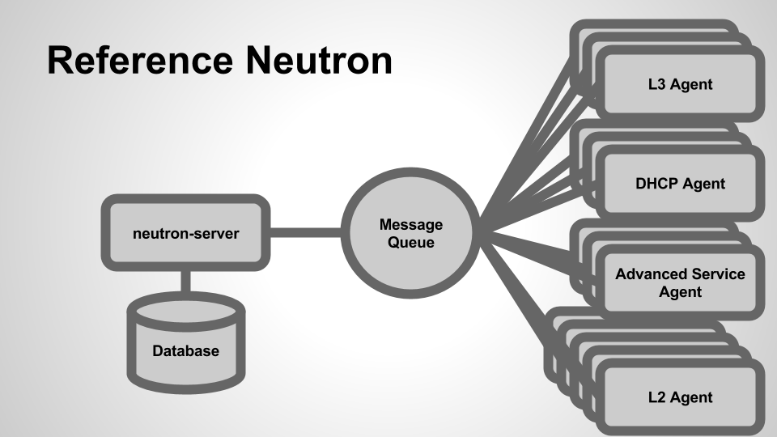
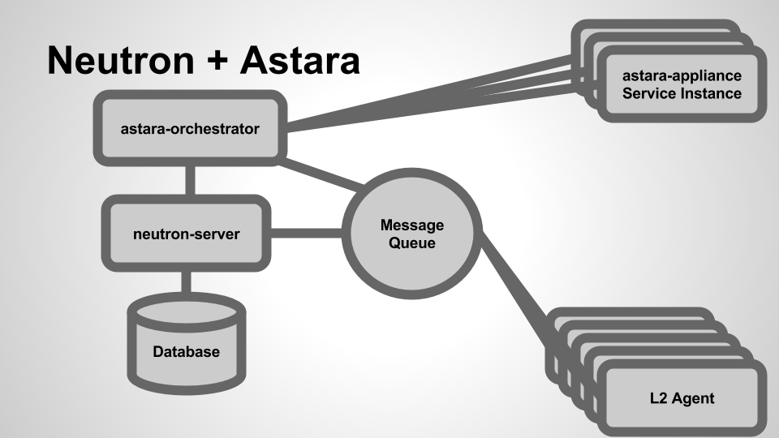

What Is Astara
==============

Astara an open source network virtualization solution built by OpenStack
operators for OpenStack clouds.

Astara follows core principles of simple, compatible, and open development.

The Astara architecture is broken down by describing the building blocks. The
most important of those building blocks, the Astara Orchestrator, is a
multi-process, multi-threaded Neutron Advanced Services orchestration service
which manages the lifecycle of the Neutron Advanced Services. Astara currently
supports a layer 3 routing and load balancing. Astara will support additional
Neuton Advanced services such as VPN, and Firewalls in the open driver model.

High-Level Architecture
-----------------------

Astara is a network orchestration platform that delivers network services
(L3-L7) via service instances that provide routing, load balancing, and
eventually more. Astara also interacts with any L2 overlay - including open
source solutions based on OVS and Linux bridge (VLAN, VXLAN, GRE) and most
proprietary solutions - to deliver a centralized management layer for all
OpenStack networking decisions.

In a typical OpenStack deployment, Neutron server emits L3 and DHCP
messages which are handled by a variety of Neutron agents (the L3 agent, DHCP
agent, agents for advanced services such as load balancing, firewall, and VPN
as a service):

When we add Astara into the mix, we're able to replace these agents with
a virtualized Service Instance that manages layer 3 routing and other advanced
networking services, significantly lowering the barrier of entry for operators
(in terms of deployment, monitoring and management):

Astara takes the place of many of the agents that OpenStack Neutron
communicates with (L3, DHCP, LBaaS, FWaaS)  and acts as a single control point
for all networking services.  By removing the complexity of extra agents, Astara
can centrally manage DHCP and L3, orchestrate load balancing and VPN Services,
and overall reduce the number of components required to build, manage and
monitor complete virtual networks within your cloud.

Astara Building Blocks
++++++++++++++++++++++

From an architectural perspective, Astara is composed of a few sub-projects:

    * | `astara <http://github.com/openstack/astara>`_

      A service for managing the creation, configuration, and health of Astara
      Service Instances.  The Orchestrator acts in part as a replacement for
      Neutron's various L3-L7 agents by listening for Neutron AMQP events and
      coalescing them into software appliance API calls (which configure and
      manage embedded services on the Service Instance).  Additionally, the
      Orchestrator contains a health monitoring component which monitors health
      and guarantees uptime for existing Service Instances.

    * | `astara-appliance <http://github.com/openstack/astara-appliance>`_

      The software and services (including tools for building custom service
      images themselves) that run on the virtualized Linux appliance. Includes
      drivers for L3-L7 services and a RESTful API that is used to orchestrate
      changes to appliance configuration.

    * | `astara-neutron <http://github.com/openstack/astara-neutron>`_

      Addon API extensions and plugins for OpenStack Neutron which enable
      functionality and integration with the Astara project, notably Astara
      router appliance interaction.

    * | `akanda-horizon <http://github.com/stackforge/akanda-neutron>`_

      OpenStack Horizon rug panels

Software Instance Lifecycle
+++++++++++++++++++++++++++

As Neutron emits events in reaction to network operations (e.g., a user creates
a new network/subnet, a user attaches a virtual machine to a network,
a floating IP address is associated, etc...), Astara Orchestrator receives these
events, parses, and  dispatches them to a pool of workers which manage the
lifecycle of every virtualized appliance.

This management of individual appliances is handled via a state machine per
appliance; as events come in, the state machine for the appropriate instance
transitions, modifying its configuration in a variety of ways, such as:

    * Booting a virtual machine for the appliance via the Nova API
    * Checking for aliveness of the Service Instance.
    * Pushing configuration updates via the :ref:`REST API
      <appliance_rest>` to configure services
      (such as ``iptables``, ``dnsmasq``, ``bird6``, etc...).
    * Deleting instances via the Nova API (e.g., when a router or load balancer
      is deleted from Neutron).

The Service Instance (the Astara Appliance)
-------------------------------------------

Astara uses Linux-based images (stored in OpenStack Glance) to provide layer 3
routing and advanced networking services. There is a stable image
available by default, but it’s also possible to build your own
custom Service Instance image (running additional services of your own on top of
the routing and other default services provided by the project).
