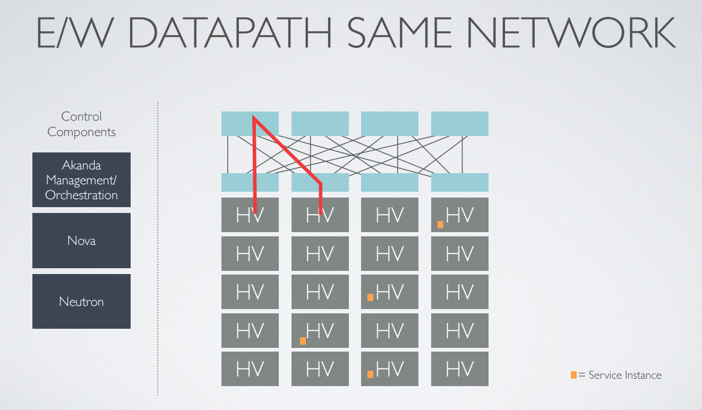

What Is Akanda
==============

Akanda is the only open source network virtualization solution built by OpenStack
operators for real OpenStack clouds.

Akanda follows core principles of simple, compatible, and open development.

The Akanda architecture is broken down by describing the building blocks. The
most important of those building blocks, the Akanda Rug, is a multi-process,
multi-threaded Neutron Advanced Services orchestration service which manages the
lifecycle of the Neutron Advanced Services. Akanda currently supports a Router
Service Instance for Neutron Advanced Services. Akanda will support additional
Neuton Advanced services such as Load Balancing, VPN, and Firewalls with the
driver model.

High-Level Architecture
-----------------------

Akanda is a network orchestration platform that delivers network services
(L3-L7) via Instances that provide routing, load balancing, firewall and more.
Akanda also interacts with any L2 overlay - including open source solutions
based on OVS and Linux bridge (VLAN, VXLAN, GRE) and most proprietary solutions
- to deliver a centralized management layer for all OpenStack networking decisions.

In a canonical OpenStack deployment, Neutron server emits L3 and DHCP
messages which are handled by a variety of Neutron agents (the L3 agent, DHCP
agent, agents for advanced services such as load balancing, firewall, and VPN
as a service):

When we add Akanda into the mix, we're able to replace these agents with
a virtualized Service Instance that manages layer 3 routing and other advanced
networking services, significantly lowering the barrier of entry for operators
(in terms of deployment, monitoring and management):

Akanda takes the place of many of the agents that OpenStack Neutron
communicates with (L3, DHCP, LBaaS, FWaaS)  and acts as a single control point
for all networking services.  By removing the complexity of extra agents, Akanda
can centrally manage DHCP and L3, orchestrate load balancing and VPN Services,
and overall reduce the number of components required to build, manage and
monitor complete virtual networks within your cloud.

Akanda Building Blocks
++++++++++++++++++++++

From an architectural perspective, Akanda is composed of a few sub-projects:

    * | :ref:`akanda-rug <http://github.com/stackforge/akanda-rug>`

      A service for managing the creation, configuration, and health of Akanda
      Service Instances in an OpenStack cloud.  The :py:mod:`akanda-rug` acts in
      part as a replacement for Neutron's various L3-L7 agents by listening for
      Neutron AMQP events and coalescing them into software
      router API calls (which configure and manage embedded services on the
      Service Instance).  Additionally, :py:mod:`akanda-rug` contains a health
      monitoring component which monitors health and guarantees uptime for
      existing Service Instances.

      The rug really ties the room together

      .. image:: _static/rug.png

    * | :ref:`akanda-appliance <http://github.com/stackforge/akanda-appliance>`

      The software and services (including tools for building custom router
      images themselves) that run on the virtualized Linux router.  Includes
      drivers for L3-L7 services and a RESTful API that :py:mod:`akanda-rug`
      uses to orchestrate changes to router configuration.

    * | `akanda-neutron <http://github.com/stackforge/akanda-neutron>`_

      Addon API extensions and plugins for OpenStack Neutron which enable
      functionality and integration with the Akanda project, notably Akanda
      router appliance interaction.

    * | `akanda-horizon <http://github.com/stackforge/akanda-neutron>`_

      OpenStack Horizon rug panels providing management of the appliance

Software Instance Lifecycle
+++++++++++++++++++++++++++

As Neutron emits events in reaction to network operations (e.g., a user creates
a new network/subnet, a user attaches a virtual machine to a network,
a floating IP address is associated, etc...), :py:mod:`akanda-rug` receives these
events, parses, and  dispatches them to a pool of workers which manage the
lifecycle of every virtualized router.

This management of individual routers is handled via a state machine per
router; as events come in, the state machine for the appropriate router
transitions, modifying its virtualized router in a variety of ways, such as:

    * Booting a virtual machine for the router via the Nova API (if one doesn't
      exist).
    * Checking for aliveness of the router via the :ref:`REST API
      <appliance_rest>` on the Service Instance.
    * Pushing configuration updates via the :ref:`REST API
      <appliance_rest>` to configure routing
      and manage services (such as ``iptables``, ``dnsmasq``, ``bird6``,
      etc...).
    * Deleting virtual machines via the Nova API (e.g., when a router is
      deleted from Neutron).

The Router Service Instance (the Akanda Appliance)
--------------------------------------------------

Akanda uses Linux-based images (stored in OpenStack Glance) to provide layer 3
routing and advanced networking services. There is a stable image
available by default, but it’s also possible to build your own
custom Service Instance image (running additional services of your own on top of
the routing and other default services provided by the project).

Traffic Flow Using Akanda Router Service Instances
--------------------------------------------------

